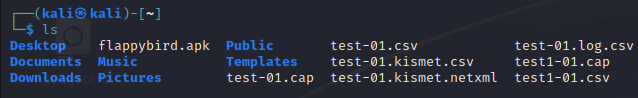
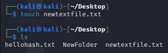
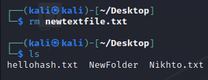
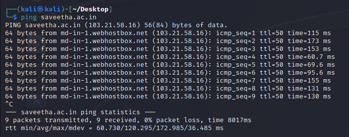

# LINUX-COMMANDS

## AIM:

To study and execute some Linux commands in terminal.

## COMMAND 1:
```
  pwd - display the location of the current working directory
```


## OUTPUT 1:


## COMMAND 2:

```
  ls - display a list of content of a directory
```

## OUTPUT 2:



## COMMAND 3:


```
  cd -  change the current directory
```

## OUTPUT3 :


## COMMAND 4:

```
  touch - create empty files
```

## OUTPUT 4:



## COMMAND 5:

```
  cat - To display the content of the file
```

## OUTPUT 5:


 
## COMMAND 6:

```
  rm - to remove a file
```

## OUTPUT 6:



## COMMAND 7:

```
   ping - check the connectivity between two nodes 
```

## OUTPUT 7:



## COMMAND 8:

```
     host - display the IP address for a given domain name and vice versa
```

## OUTPUT 8:


## COMMAND 9:

```
       whoami - Get the active username
```

## OUTPUT 9:


## COMMAND 10:

```
         ps - Display active processes
```

## OUTPUT 10:


## RESULT:

Therefore, the basis of LINUX commands are studied and executed successfully.
